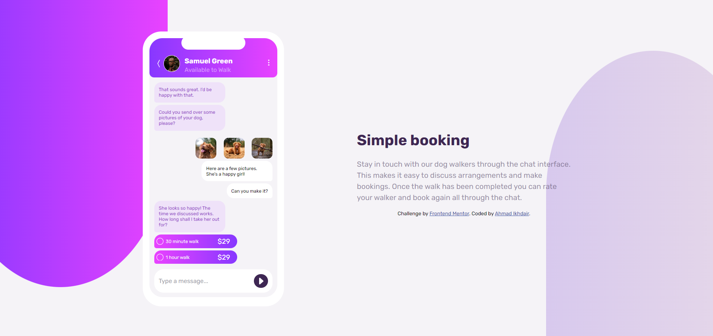
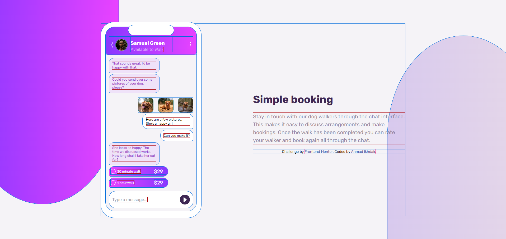
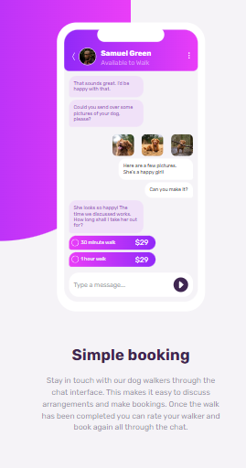

# Frontend Mentor - Chat-app-CSS-illustration with flexbox and grid.

This is a solution to the [Chat-app-CSS-illustration with flexbox and grid.](https://www.frontendmentor.io/challenges/chat-app-css-illustration-O5auMkFqY). 

## Table of contents

- [Overview](#overview)
  - [Screenshot](#screenshot)
  - [Links](#links)
- [My process](#my-process)
  - [Built with](#built-with)
- [Author](#author)

## Overview

Early practice, planning on redoing this as there is a lot to fix, especially for responsiveness. Still very proud of how it came out on the desktop!

### Screenshot

### Links

- Solution URL:  [Solution](https://www.frontendmentor.io/solutions/chatappcssillustration-with-flexbox-and-grid-oIRYoEC4j5)
- Live Site URL:  [Live site](https://ahmadikhdair.github.io/Chat-app-CSS-illustration/)

## My process

### Built with

- Semantic HTML5 markup
- CSS
- CSS grid
- CSS flexbox

## Author

- LinkedIn -  [Ahmad Ikhdair](https://www.linkedin.com/in/ahmad-ikhdair/)
- Frontend Mentor -  [Ahmad Ikhdair](https://www.frontendmentor.io/profile/AhmadIkhdair)
